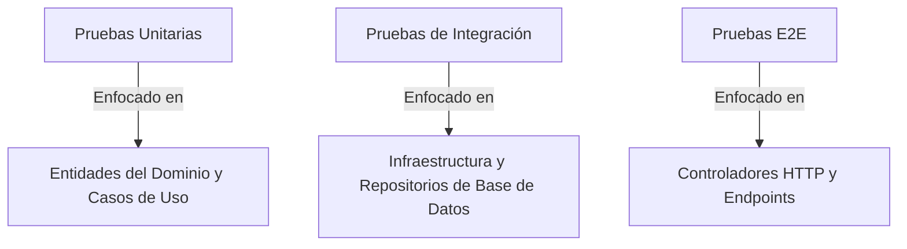

# 🧪 Guía de Arquitectura y Estrategia de Pruebas del Backend

Esta guía describe la configuración de pruebas, las pruebas de integración migradas a Jest, el reporte de cobertura de código, los comandos de ejecución y los patrones de arquitectura recomendados para escalar la suite de pruebas del backend.

---

## 🚀 1. Pruebas de Integración E2E Migradas

Hemos migrado el ejecutor de pruebas nativo de Node (`node:test`) a **Jest** bajo el archivo [`test/auth-and-user.e2e-spec.ts`](file:///home/acide/Escritorio/universidad/software-project-management-course-project/backend/test/auth-and-user.e2e-spec.ts).

### Funcionalidades Cubiertas
1. **Autenticación (Better Auth):**
   - Registro (`POST /api/auth/sign-up/email`)
   - Autenticación y generación de cookies de sesión (`POST /api/auth/sign-in/email`)
   - Obtención de sesión usando cookies (`GET /api/auth/get-session`)
   - Destrucción de sesión (`POST /api/auth/sign-out`)
2. **Administración de Usuarios (CRUD):**
   - Rechazo de accesos no autorizados sin cookie de sesión (`401 Unauthorized`)
   - Obtención paginada de la lista de usuarios (`GET /api/users`) con parámetros de tamaño y página
   - Obtención de un usuario específico por ID (`GET /api/users/:id`)
   - Actualización de datos de usuario (`PUT /api/users/:id`)
   - Eliminación de usuarios (`DELETE /api/users/:id`)

---

## 📊 2. Ejecución y Cobertura de Código

Las pruebas se ejecutan en un entorno CommonJS utilizando un transpilador personalizado para permitir la compilación de dependencias ESM puras como `better-auth`.

### Comandos

* **Ejecutar Pruebas E2E:**
  ```bash
  pnpm run test:e2e
  ```
  *(Ejecuta Jest usando la configuración en `test/jest-e2e.json` y automáticamente aplica la bandera `--forceExit` para cerrar los pools de conexión a la base de datos).*

* **Ejecutar Pruebas E2E con Cobertura:**
  ```bash
  pnpm run test:e2e --coverage
  ```
  *(Ejecuta las pruebas y genera un reporte detallado de cobertura en el directorio `coverage/`).*

---

## 🏛️ 3. Arquitectura Recomendada para Pruebas del Backend

Para expandir la cobertura y mantener un conjunto de pruebas limpio, recomendamos dividir las pruebas en tres capas bien diferenciadas, siguiendo el estilo de arquitectura limpia y hexagonal del proyecto:



### Capa 1: Pruebas Unitarias (Alta Velocidad, Alta Cobertura)
- **Objetivo:** Entidades de Dominio (`src/domain/entities`) y Casos de Uso (`src/application/use-cases`).
- **Estrategia:** Mockear todos los servicios externos e infraestructura (por ejemplo, repositorios, proveedores de correo) utilizando las capacidades de simulación de Jest (`jest.fn()`).
- **Meta:** Cubrir reglas de negocio, validaciones, casos límite y excepciones personalizadas sin abrir conexiones a la base de datos.

### Capa 2: Pruebas de Integración (Velocidad Media, Alta Confiabilidad)
- **Objetivo:** Repositorios de base de datos de Prisma (`src/infrastructure/persistence/prisma/repositories`).
- **Estrategia:** Verificar la lógica de consultas, restricciones de base de datos y relaciones.
- **Herramientas:** Usar una instancia de base de datos local de prueba (o contenedores ligeros mediante Testcontainers-postgres).

### Capa 3: Pruebas End-to-End (E2E) (Velocidad Baja, Máxima Confianza)
- **Objetivo:** Capa de controladores y HTTP (`src/presentation/controllers`).
- **Estrategia:** Levantar el contenedor completo de la aplicación (`AppModule`) mediante `@nestjs/testing` y realizar peticiones HTTP reales usando `supertest`.
- **Control de Estado de BD:** Limpiar y resetear el estado de la base de datos para cada suite de prueba. Recomendamos:
  - Envolver las pruebas en transacciones con rollback automático.
  - O realizar limpieza explícita de registros en hooks `beforeEach`/`afterEach` (como se implementó en `auth-and-user.e2e-spec.ts`).
