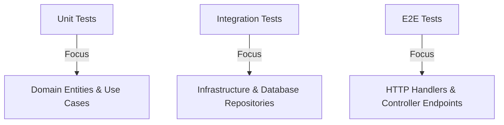

# 🧪 Backend Testing Strategy & Architecture Guide

This guide describes the testing setup, the migrated Jest integration tests, code coverage reporting, execution commands, and recommended architectural patterns for scaling the backend test suite.

---

## 🚀 1. Migrated E2E Integration Tests

We have migrated the legacy Node-native test runner (`node:test`) to **Jest** under the file [`test/auth-and-user.e2e-spec.ts`](file:///home/acide/Escritorio/universidad/software-project-management-course-project/backend/test/auth-and-user.e2e-spec.ts).

### Covered Features
1. **Authentication (Better Auth):**
   - Registration (`POST /api/auth/sign-up/email`)
   - Authentication & session cookie generation (`POST /api/auth/sign-in/email`)
   - Session retrieval using cookies (`GET /api/auth/get-session`)
   - Session destruction (`POST /api/auth/sign-out`)
2. **User Administration (CRUD):**
   - Access rejection for unauthenticated users (`401 Unauthorized`)
   - Paginated user list queries (`GET /api/users`) with size & page parameters
   - Retrieve a single user profile by ID (`GET /api/users/:id`)
   - Update user properties (`PUT /api/users/:id`)
   - Delete user profiles (`DELETE /api/users/:id`)

---

## 📊 2. Execution & Code Coverage

Tests are executed in a CommonJS wrapper utilizing a custom transpiler to enable compilation of ESM dependencies like `better-auth`.

### Commands

* **Run E2E Tests:**
  ```bash
  pnpm run test:e2e
  ```
  *(Runs Jest using config in `test/jest-e2e.json` and automatically issues `--forceExit` to shut down background DB connection pools).*

* **Run E2E Tests with Coverage:**
  ```bash
  pnpm run test:e2e --coverage
  ```
  *(Runs tests and writes a comprehensive coverage report to the `coverage/` directory).*

---

## 🏛️ 3. Recommended Backend Testing Architecture

To expand coverage and maintain a clean test suite, we recommend dividing tests into three distinct layers matching the NestJS Hexagonal/Clean architecture style of the project:



### Layer 1: Unit Tests (High Speed, High Coverage)
- **Target:** Domain Entities (`src/domain/entities`) and Use Cases (`src/application/use-cases`).
- **Strategy:** Mock all external infrastructure services (e.g. repositories, email providers) using Jest's mocking capabilities (`jest.fn()`).
- **Goal:** Cover business rules, validation constraints, edge cases, and custom exceptions without opening database connections.

### Layer 2: Integration Tests (Medium Speed, High Reliability)
- **Target:** Database Repositories (`src/infrastructure/persistence/prisma/repositories`).
- **Strategy:** Verify query logic, constraints, and relationships.
- **Tools:** Use a local test database instance (or a lightweight SQLite in-memory database if schema matches, or Postgres container).

### Layer 3: End-to-End (E2E) Tests (Low Speed, High Confidence)
- **Target:** API Gateways/HTTP Layer (`src/presentation/controllers`).
- **Strategy:** Bootstrapping the entire application container (`AppModule`) using `@nestjs/testing` and firing actual HTTP requests using `supertest`.
- **Database State Control:** For each test suite run, reset/seed database states. We recommend:
  - Wrapping tests in a rollback-only database transaction.
  - Or cleaning up/deleting records in `beforeEach`/`afterEach` hooks (as done in `auth-and-user.e2e-spec.ts`).
